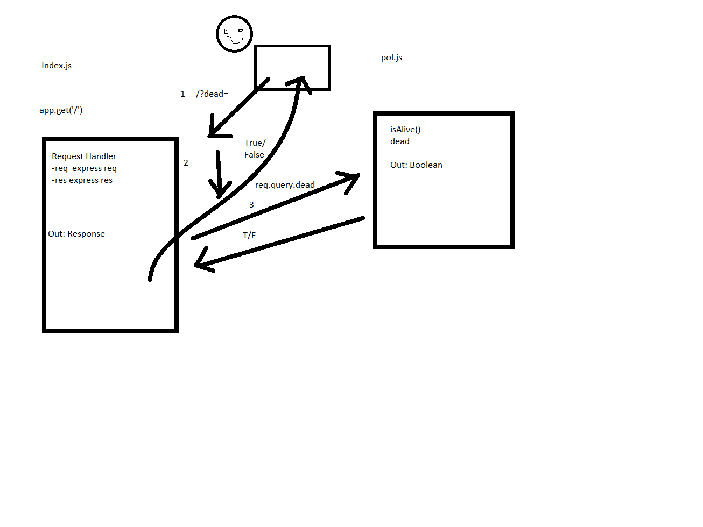

# LAB - 00

## Project: Proof of Life Server

### Author: Ashley Biermann

### Links and Resources

- [submission PR](https://github.com/401-advanced-javascript-ashley-biermann/lab-00/pull/1)
- [ci/cd](http://xyz.com) (GitHub Actions)
- [front-end application](https://biermann-lab-00.herokuapp.com/)

#### Documentation

- [jsdoc](https://biermann-lab-00.herokuapp.com/docs/)

##### Exported Values and Methods

###### `isAlive(dead) -> boolean`

Returns true/false to indicate how the server works

### Setup

#### `.env` requirements (where applicable)

- `PORT` - Port Number

#### How to initialize/run your application (where applicable)

- `npm start`

- Endpoint: `/`
  - Returns a boolean
- Endpoint:  `/docs`
  - Returns JSDoc Documentation Pages

#### How to use your library (where applicable)

#### Tests

- Unit Tests: `npm test`
- Lint Tests: `npm run lint`
- Any tests of note?

#### UML

